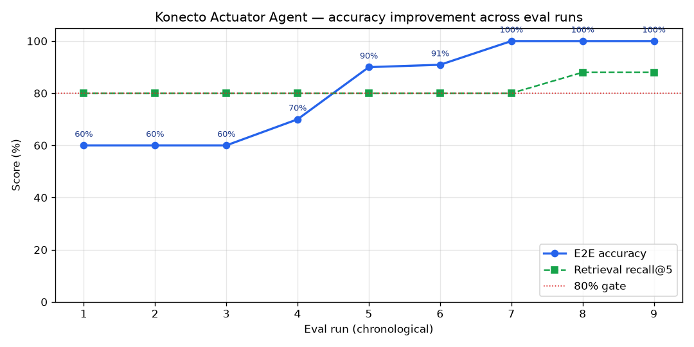

# Konecto Actuator Agent

> A production-shaped conversational AI service for querying and recommending **Bettis
> Series 76 electric actuators** — built around a LangChain `create_agent` ReAct agent, hybrid retrieval
> (SQLite exact-match + ChromaDB semantic re-rank), persistent multi-turn memory, an MCP
> server for external agents, and a **statistical evaluation harness** that measures
> accuracy, retrieval health, and prompt regressions.

---

## Table of Contents

1. [What this is](#what-this-is)
2. [Architecture at a glance](#architecture-at-a-glance)
3. [How a query flows](#how-a-query-flows)
4. [Prerequisites](#prerequisites)
5. [Local setup](#local-setup)
6. [Docker](#docker)
7. [Configuration](#configuration)
8. [Quickstart — copy-paste examples](#quickstart--copy-paste-examples)
9. [API reference](#api-reference)
10. [MCP integration](#mcp-integration)
11. [Evaluation & quality](#evaluation--quality)
12. [Testing](#testing)
13. [Project layout](#project-layout)
14. [Design decisions](#design-decisions)
15. [Security](#security)
16. [Troubleshooting](#troubleshooting)
17. [For AI agents](#for-ai-agents)

---

## What this is

A user (or another AI agent) asks, in natural language, about Series 76 actuators —
either by exact part number ("specs for 763A00-11320000/A") or by requirement
("a 24V modulating actuator for at least 100 Nm"). The service answers using **only
catalog data retrieved through tools** — it never fabricates specs or part numbers.

It exposes the same two capabilities two ways:

- **REST API** — `POST /api/conversation` (the assessment contract; plus an optional
  `POST /api/conversation/stream` SSE variant)
- **MCP server** — `/mcp/`, so Claude Desktop / Cursor / any MCP client can call
  `get_actuator` and `recommend` as tools

Under the hood both share the same two LangChain tools (`get_actuator_by_part_number`,
`recommend_actuators`) and the same agent.

The catalog: **111 actuator configurations** (64 distinct base part numbers across
voltages, enclosures, and application types), extracted from the Series 76 PDF datasheet.

---

## Architecture at a glance

```
                         ┌─────────────────────────────────────────────┐
                         │              FastAPI app (main.py)            │
                         │   /health  /cache/stats  /api/conversation    │
   HTTP / curl  ───────► │   /api/conversation/stream     /mcp/  ◄────── │ ◄──── MCP client
                         │   rate-limit (slowapi 30/min) · error handler │      (Claude Desktop,
                         └───────────────┬───────────────────────┬──────┘       Cursor, agents)
                                         │                        │
                                ┌────────▼────────┐      ┌────────▼─────────┐
                                │  create_agent    │      │   FastMCP server  │
                                │  ReAct (agent.py)│      │  (mcp_server.py)  │
                                │  model: gpt-5-mini│     │ get_actuator /    │
                                └────────┬─────────┘      │ recommend tools   │
                          tool calls     │                └────────┬──────────┘
                       ┌─────────────────┴──────────────────┐      │
                       ▼                                     ▼      ▼
           ┌────────────────────────┐          ┌──────────────────────────────┐
           │ get_actuator_by_part_# │          │      recommend_actuators       │
           │  exact lookup           │          │  1. LLM → Pydantic filters     │
           │                         │          │  2. SQLite hard WHERE filter   │
           │                         │          │  3. ChromaDB semantic re-rank  │
           └───────────┬────────────┘          └───────┬────────────────┬───────┘
                       │                                │                │
                 ┌─────▼──────┐                  ┌──────▼─────┐   ┌──────▼──────┐
                 │  SQLite     │                  │  SQLite    │   │  ChromaDB    │
                 │ actuators.db│                  │ (filter)   │   │ (vector idx) │
                 └─────────────┘                  └────────────┘   └──────────────┘

   Memory: AsyncSqliteSaver checkpointer (memory.db) — one thread per session_id
```

**Stack:** FastAPI · LangChain (`create_agent`, runs on LangGraph) · OpenAI
(`gpt-5-mini` + `text-embedding-3-small`) · ChromaDB · SQLite · FastMCP · slowapi · Pydantic.

---

## How a query flows

**Exact part number** ("specs for 763A00-11320000/A"):
the agent calls `get_actuator_by_part_number` → direct SQLite `SELECT` → deterministic,
O(1), no embedding involved. Fuzzy match (`rapidfuzz`) suggests the right PN on a typo.

**Natural-language recommendation** ("24V modulating actuator over 100 Nm"):
1. The LLM extracts **structured filters** into a Pydantic model (`torque_nm_min`,
   `voltage`, `enclosure_type`, `application_type`) — fields are closed `Literal` enums so
   the model can't inject out-of-domain values.
2. SQLite applies those as a **hard `WHERE` filter** — this is what guarantees correctness
   (an actuator either meets 100 Nm or it doesn't; SQL decides, not the embedding).
3. ChromaDB **semantically re-ranks** the already-valid candidates, scoped by a metadata
   `where` to the SQL result set.

> **Key design point:** the embedding is a *re-ranker over a pre-filtered set*, never the
> source of truth. This is why a small embedding model is sufficient (see
> [Design decisions](#design-decisions)).

**Multi-turn:** every request carries a `session_id` → mapped to a LangGraph `thread_id`
→ persisted by `AsyncSqliteSaver`. Follow-ups ("what's its enclosure?") resolve against
prior turns without re-sending history.

---

## Prerequisites

- **Python 3.11+**
- **OpenAI API key** (for `gpt-5-mini` and `text-embedding-3-small`)
- **Docker + Docker Compose** (optional, for containerized run)
- **OpenRouter API key** (optional — only for the eval LLM-judge and PDF extraction)

---

## Local setup

```bash
# 1. Enter the directory
cd konecto-assessment

# 2. Copy and fill the environment file
cp .env.example .env
#    Edit .env — at minimum set OPENAI_API_KEY=sk-...

# 3. Install dependencies
pip install -r requirements.txt

# 4. Ingest actuator data (validates actuators.json, builds SQLite + ChromaDB)
python scripts/ingest.py

# 5. Start the server
uvicorn app.main:app --reload
```

Server listens on `http://localhost:8000`. Verify:

```bash
curl http://localhost:8000/health      # {"status":"ok"}
```

> **Windows note:** if running directly (not Docker), the server loads `.env` via
> `python-dotenv`. Ensure `OPENAI_API_KEY` is set or the app exits at startup with a clear error.

---

## Data preprocessing pipeline

The raw source data is the Series 76 datasheet PDF (shipped in `data/raw/`). The pipeline
is **two stages**, and the processed output is committed so step 4 above works without
re-running extraction:

```
data/raw/series_76_tables.pdf
        │  scripts/extract_pdf.py   (PDF → structured JSON via an LLM, OpenRouter)
        ▼
data/actuators.json          ← committed; the processed data
        │  scripts/ingest.py        (validate w/ Pydantic → SQLite + ChromaDB)
        ▼
data/actuators.db  +  data/chroma/
```

**Stage 1 — extract (optional, only to regenerate the JSON):**

Uses **Google Gemini 2.5 Flash via OpenRouter** for the PDF → JSON extraction — a
multimodal model reads the datasheet tables directly (no brittle PDF-text parsing) and the
output is validated row-by-row against the Pydantic `Actuator` schema before it's written.

```bash
# Requires OPENROUTER_API_KEY. Reads data/raw/series_76_tables.pdf,
# writes data/actuators.json (validated against the Pydantic schema).
python scripts/extract_pdf.py
# or point at a different PDF (e.g. the assessment's series_76_electric_data.pdf):
python scripts/extract_pdf.py path/to/series_76_electric_data.pdf
```

> **Why Gemini for extraction (not the chat model)?** The datasheet is a dense, multi-column
> table PDF. Gemini 2.5 Flash is multimodal and cheap, reads the tables natively, and this is
> a **one-shot offline step** — the result (`data/actuators.json`) is committed, so the model
> choice here is independent of the runtime agent (`gpt-5-mini`).

> **Note:** re-extraction is **optional** — `data/actuators.json` is already committed, so
> `ingest.py` alone reproduces the databases. The bundled `data/raw/series_76_tables.pdf` is
> the assessment's `series_76_electric_data.pdf` (renamed); pass your own path as the argument
> above if you want to re-run extraction against a different file.

**Stage 2 — ingest (always required before first run):**
```bash
python scripts/ingest.py    # actuators.json → SQLite + ChromaDB (idempotent)
```

`actuators.json` is committed, so a fresh clone only needs **Stage 2**. Stage 1 is there
for full reproducibility and to handle a different/updated PDF.

> `data/summary.txt` (business context injected into the system prompt) is committed and
> derived from `series_76_summary.pdf`. It is loaded at startup by `app/prompts.py`.

---

## Docker

```bash
cp .env.example .env          # set OPENAI_API_KEY
docker compose up --build     # build the image, run ingest on first boot, serve

# then, in another terminal — bash:
curl http://localhost:8000/health
# …or Windows PowerShell:
Invoke-RestMethod http://localhost:8000/health
# → {"status":"ok"}
```

That's the whole flow — **no manual ingest step.** On first boot the entrypoint runs
`scripts/ingest.py` (it sees the empty data volume), builds SQLite + ChromaDB from the
baked-in `data/actuators.json`, then starts the server. You'll see in the logs:

```
agent-1  | [entrypoint] data volume empty — running ingest.py...   ← first boot only
agent-1  | INFO:     Application startup complete.
agent-1  | INFO:     Uvicorn running on http://0.0.0.0:8000
```

Subsequent starts **skip ingest** (`[entrypoint] actuators.db present — skipping ingest`)
because the named volume persists `actuators.db` across `docker compose down` / `up`.

```bash
docker compose down       # stop & remove the container — KEEPS the data volume
docker compose down -v     # also wipe the volume → next `up` re-runs ingest from scratch
```

- Multi-stage build, runs as **non-root** (UID 10001), **tini** as PID 1 for signal handling.
- `docker-compose.yml` mounts a named volume `actuator-data` at `/app/data` (SQLite,
  ChromaDB, memory DB persist across restarts).
- Health check probes `GET /health` (30s interval, 20s start period).
- Set secrets via the `.env` file — never bake keys into the image.

> First boot does one round of embedding calls (ingest), so give it a few seconds before
> the health check passes. `OPENAI_API_KEY` must be set or ingest fails fast with a clear error.
> **Windows:** Docker Desktop must be running (WSL2 backend) before `docker compose up`.

---

## Configuration

All config is environment-driven (`app/config.py`, Pydantic `BaseSettings`). See `.env.example`.

| Variable | Default | Purpose |
|----------|---------|---------|
| `OPENAI_API_KEY` | — (required) | LLM + embeddings |
| `MODEL_NAME` | `gpt-5-mini` | Chat model (all three permitted models tie at 100% — see [model comparison](docs/MODEL_COMPARISON.md)) |
| `EMBEDDING_MODEL` | `text-embedding-3-small` | Embedding model for ChromaDB |
| `SQLITE_DB_PATH` | `data/actuators.db` | Catalog DB |
| `CHROMA_PATH` | `data/chroma` | Vector index dir |
| `MEMORY_DB_PATH` | `data/memory.db` | Conversation checkpointer DB |
| `RATE_LIMIT` | `30/minute` | Per-IP rate limit |
| `OPENROUTER_API_KEY` | — | (Optional) eval LLM-judge + PDF extraction (`scripts/extract_pdf.py`, Gemini 2.5 Flash) |
| `EVAL_JUDGE_MODEL` | `openai/gpt-4o-mini` | (Optional) OpenRouter model for the eval judge |

---

## Quickstart — copy-paste examples

Once the server is up (`uvicorn app.main:app` or `docker compose up`), these are the four
things worth trying. Each is shown for **bash/macOS/Linux** and **Windows PowerShell**.

### 1. Health check
```bash
curl http://localhost:8000/health
```
```powershell
Invoke-RestMethod http://localhost:8000/health
```
→ `{"status":"ok"}`

### 2. Exact part-number lookup
```bash
curl -X POST http://localhost:8000/api/conversation \
  -H "Content-Type: application/json" \
  -d '{"query": "What are the specs for 763A00-11320000/A?"}'
```
```powershell
Invoke-RestMethod -Uri http://localhost:8000/api/conversation -Method POST `
  -ContentType "application/json" `
  -Body '{"query": "What are the specs for 763A00-11320000/A?"}'
```
→ `{"answer":"The 763A00-11320000/A is a weatherproof, 110V ... ","session_id":"<uuid>"}`

### 3. Natural-language recommendation
```bash
curl -X POST http://localhost:8000/api/conversation \
  -H "Content-Type: application/json" \
  -d '{"query": "I need a 24V modulating actuator for at least 100 Nm"}'
```
```powershell
Invoke-RestMethod -Uri http://localhost:8000/api/conversation -Method POST `
  -ContentType "application/json" `
  -Body '{"query": "I need a 24V modulating actuator for at least 100 Nm"}'
```
→ The agent extracts filters (voltage=24V, application=modulating, torque≥100 Nm), runs
SQL + ChromaDB, and returns ranked real part numbers — never a fabricated one.

### 4. Multi-turn follow-up (memory)
First call returns a `session_id`; pass it back to continue the conversation:
```bash
# First turn — note the session_id in the response
curl -X POST http://localhost:8000/api/conversation \
  -H "Content-Type: application/json" \
  -d '{"query": "Recommend a weatherproof 110V on/off actuator."}'

# Follow-up — reuse that session_id, ask about "it" without repeating context
curl -X POST http://localhost:8000/api/conversation \
  -H "Content-Type: application/json" \
  -d '{"query": "What is its torque rating?", "session_id": "<uuid-from-above>"}'
```
```powershell
$r = Invoke-RestMethod -Uri http://localhost:8000/api/conversation -Method POST `
  -ContentType "application/json" `
  -Body '{"query": "Recommend a weatherproof 110V on/off actuator."}'
Invoke-RestMethod -Uri http://localhost:8000/api/conversation -Method POST `
  -ContentType "application/json" `
  -Body (@{ query = "What is its torque rating?"; session_id = $r.session_id } | ConvertTo-Json)
```

> **PowerShell gotcha:** paste each command on its own — don't include the `PS C:\...>`
> prompt prefix. For inline JSON, single-quote the `-Body` so PowerShell doesn't try to
> expand it; for dynamic values use `@{ ... } | ConvertTo-Json` as in turn 2 above.

---

## API reference

### `GET /health`
Liveness probe.
```bash
curl http://localhost:8000/health
# {"status":"ok"}
```

### `POST /api/conversation`
Single request, full JSON response.
```bash
curl -X POST http://localhost:8000/api/conversation \
  -H "Content-Type: application/json" \
  -d '{"query": "What are the specs for 763A00-11320000/A?"}'
# {"answer":"...","session_id":"<uuid>"}
```
Resume a session by passing the returned `session_id`:
```bash
curl -X POST http://localhost:8000/api/conversation \
  -H "Content-Type: application/json" \
  -d '{"query": "What is its enclosure type?", "session_id": "<uuid>"}'
```
Request body: `query` (1–2000 chars, required), `session_id` (optional, `[a-zA-Z0-9-]`).

### `POST /api/conversation/stream`
Same input, streamed as Server-Sent Events.
```bash
curl -N -X POST http://localhost:8000/api/conversation/stream \
  -H "Content-Type: application/json" \
  -d '{"query": "Recommend a 24V modulating actuator."}'
# data: {"type":"session","session_id":"..."}
# data: {"type":"tool_start","name":"recommend"}
# data: {"type":"token","text":"..."}
# data: [DONE]
```

### `GET /cache/stats`
In-memory TTL cache occupancy for actuator part-number lookups (maxsize 500, 1h TTL).
```bash
curl http://localhost:8000/cache/stats
# {"actuator_cache":{"size":1,"maxsize":500}}
```

**Rate limit:** both conversation endpoints are limited to `30/minute` per IP (HTTP 429
on exceed); `/health` and `/cache/stats` are unlimited.

---

## MCP integration

The FastMCP server is mounted at **`/mcp/`** and exposes two read-only tools:

- **`get_actuator`** — exact lookup by base part number
- **`recommend`** — natural-language requirement matching

### Verify the MCP server (no desktop client needed)

With the service running (`docker compose up` or `uvicorn app.main:app`), this connects over
the MCP HTTP transport, lists the tools, and calls both — the same handshake your AI agent does:

```bash
pip install fastmcp   # already in requirements.txt
python - <<'PY'
import asyncio
from fastmcp import Client

async def main():
    async with Client("http://localhost:8000/mcp/") as c:
        tools = await c.list_tools()
        print("tools:", [t.name for t in tools])                       # ['get_actuator', 'recommend']
        r = await c.call_tool("get_actuator", {"part_number": "763A00-11320000/A"})
        print(r.content[0].text[:120])
        r = await c.call_tool("recommend", {"requirements": "24V modulating actuator at least 100 Nm"})
        print(r.content[0].text[:120])

asyncio.run(main())
PY
```

Expected: `tools: ['get_actuator', 'recommend']` followed by real specs and recommendations.

### Claude Desktop
`~/Library/Application Support/Claude/claude_desktop_config.json` (macOS) /
`%APPDATA%\Claude\claude_desktop_config.json` (Windows):
```json
{
  "mcpServers": {
    "konecto-actuators": { "url": "http://localhost:8000/mcp/", "transport": "http" }
  }
}
```

### Cursor
`.cursor/mcp.json`:
```json
{
  "mcpServers": {
    "konecto-actuators": { "url": "http://localhost:8000/mcp/", "transport": "http" }
  }
}
```

### Install the Agent Skill

The skill manifest is [`SKILL.md`](SKILL.md) at the repo root. Install it by copying it into
your agent's skills directory under a named folder (the folder name becomes the skill ID):

```bash
# Claude Code / Claude Desktop — user-level (available in every project):
mkdir -p ~/.claude/skills/recommending-actuators
cp SKILL.md ~/.claude/skills/recommending-actuators/SKILL.md

# …or project-level (scoped to one repo): copy to .claude/skills/recommending-actuators/SKILL.md
# Cursor: copy to .cursor/skills/recommending-actuators/SKILL.md
```

Then start the service (`docker compose up` or `uvicorn app.main:app`) so the MCP endpoint at
`http://localhost:8000/mcp/` is reachable, and reload your agent. The skill drives the two MCP
tools (`get_actuator`, `recommend`) to accomplish actuator lookup and recommendation tasks.

---

## Evaluation & quality

A statistical evaluation harness lives in `app/eval/`, driven by `scripts/eval.py`. It
answers three questions **with numbers**, and full details are in
[`docs/EVAL.md`](docs/EVAL.md).

```bash
python scripts/eval.py                 # retrieval + 11 E2E cases, 80% gate
python scripts/eval.py --retrieval-only   # fast index-health check, no LLM E2E calls
python scripts/eval.py --compare-prompts prompts/proactive.txt   # A/B prompt variants
python scripts/plot_progress.py        # render the accuracy-progression chart (PNG)
```

Each run is saved to `eval_runs/<timestamp>.json` and diffed against the previous one
(improved / regressed / unchanged per case). `eval.py` also writes a self-contained
`eval_report.html` dashboard (Chart.js, no server needed — open it in a browser), and
`scripts/plot_progress.py` turns the run history into the progression chart below.

### Accuracy was measured, not assumed

The agent started at **60%** E2E accuracy and was iterated to **100%** — each step driven by
the eval, not intuition (the full story is in [`docs/ITERATION.md`](docs/ITERATION.md)).



> The green line (retrieval recall@5) stays flat while accuracy climbs — proof the gains came
> from prompt/tool fixes, not from changing the index. The red dotted line is the 80% gate.

### 1. Is the agent accurate? (end-to-end)

11 cases, each graded by the cheapest reliable method:

| Grader | Cases | Method |
|--------|-------|--------|
| `exact` | exact PN lookup | PN appears verbatim — deterministic |
| `spec` | spec lookup | answer states the catalog value — deterministic |
| `filter` | NL recommendation | every PN mentioned is in the catalog-derived valid set — deterministic |
| `judge` | out-of-domain, prompt-injection, session memory | LLM-as-judge (OpenRouter) for quality |

Determinism where truth is verifiable; the LLM judge only where quality isn't a fact.
**Current: 11/11 (100%).**

### 2. Is the RAG index healthy? (retrieval, measured in isolation)

Because `recommend` does *SQL filter → ChromaDB re-rank*, retrieval is evaluated
**without the LLM** so a failure points at the index, not the prose:

- **Index health:** indexed docs vs catalog rows — **111/111, no ingest loss.**
- **recall@k / precision@k** — proportional (hits ÷ reachable, *not* binary), so a large
  valid set can't inflate the score. **Segmented by query kind:**

| Query kind | recall@5 | Reading |
|------------|----------|---------|
| `fuzzy` ("hazardous location") | 100% | semantic intent — the embedding's core job |
| `categorical` ("24V modulating") | 100% | needs query phrasing to match indexed format ("24V" not "24 volt") |
| `numeric` ("≥500 Nm") | ~70% | embeddings are weak on exact numbers — **and SQL already filters by number, so this rarely matters in production** |

> An aggregate "recall@5" is meaningless unsegmented — the same 80% is excellent for fuzzy
> queries and irrelevant for numeric ones (SQL handles those). The report always shows the
> segments. See [`docs/EVAL.md`](docs/EVAL.md) for how to read them.

### 3. Did a change make it better or worse? (regression)

Every run is saved to `eval_runs/<timestamp>.json`. The report diffs the current run
against the previous one and tags each case **improved / regressed / unchanged / new**.
This is how the production prompt was chosen: an A/B showed the "proactive" variant moved
recommendation accuracy from 1/3 → 3/3, so it was promoted — **measured, not assumed.**

### Which chat model? (decided with data)

The same eval suite was run **3× against each** of the three permitted models
(`gpt-5-mini`, `gpt-5.1`, `gpt-5.2`) against the **real** LLM. Full results, per-model
progression charts, and the side-by-side comparison are in
[`docs/MODEL_COMPARISON.md`](docs/MODEL_COMPARISON.md).

| Model | Mean E2E accuracy | Retrieval recall@5 |
|-------|-------------------|--------------------|
| `gpt-5-mini` | 100% | 88% |
| `gpt-5.1` | 100% | 88% |
| `gpt-5.2` | 100% | 88% |

All three tie at 100% — the **retrieval pipeline is the dominant factor, not the chat
model** (recall@5 is identical because it depends only on the embedding model). `gpt-5-mini`
is kept as the default: cost-optimal with no accuracy loss. Reproduce with
`python scripts/compare_models.py`.

---

## Testing

Offline, deterministic, fully mocked (no real OpenAI/ChromaDB network calls):

```bash
pytest tests/ -q
# 13 passed
```

| File | Covers |
|------|--------|
| `tests/test_tools.py` | tool logic — exact/fuzzy lookup, recommend filter+rerank, no-match |
| `tests/test_edge_cases.py` | input validation (422s), out-of-domain handling |
| `tests/test_api.py` | `/api/conversation`, `/health`, `/cache/stats` via TestClient |

Each `app/eval/` module also has a runnable self-check: `python -m app.eval.<module>`.

---

## Project layout

```
konecto-assessment/
├── app/
│   ├── main.py            # FastAPI app: lifespan, endpoints, rate limit, error handler
│   ├── agent.py           # langchain.agents.create_agent + AsyncSqliteSaver memory
│   ├── prompts.py         # System prompt (proactive recommend + security guardrails)
│   ├── config.py          # Pydantic BaseSettings (env-driven)
│   ├── cache.py           # In-memory TTL cache for part-number lookups (cachetools, 1h TTL)
│   ├── mcp_server.py      # FastMCP server, mounted at /mcp/
│   ├── db/
│   │   ├── schema.py      # Pydantic Actuator model (ingest validation)
│   │   ├── sqlite.py      # SQLite connection helper
│   │   └── chroma.py      # ChromaDB singleton (built once at startup)
│   ├── tools/
│   │   ├── get_actuator.py  # Tool 1: exact + fuzzy PN lookup
│   │   └── recommend.py     # Tool 2: Pydantic filters → SQL → Chroma re-rank
│   └── eval/              # Evaluation harness (see docs/EVAL.md)
│       ├── catalog.py     # golden answers derived from the live DB
│       ├── graders.py     # exact / spec / filter / judge graders
│       ├── retrieval.py   # index health + segmented recall@k/precision@k
│       ├── cases.py       # declarative test cases
│       ├── runner.py      # runs cases, dispatches graders
│       ├── history.py     # run persistence + per-case regression diff
│       └── report.py      # self-contained HTML report (Chart.js)
├── scripts/
│   ├── ingest.py          # idempotent: JSON → validated → SQLite + ChromaDB
│   ├── eval.py            # evaluation CLI
│   ├── extract_pdf.py     # PDF → structured JSON (Gemini 2.5 Flash via OpenRouter)
│   └── compare_models.py  # eval the 3 permitted chat models, 3 runs each (docs/MODEL_COMPARISON.md)
├── tests/                 # pytest suite (mocked, offline)
├── docs/EVAL.md           # evaluation harness guide
├── data/
│   ├── raw/               # source PDFs (series_76_tables.pdf, series_76_summary.pdf)
│   ├── actuators.json     # processed data (committed)
│   ├── summary.txt        # business context for the system prompt (committed)
│   └── *.db, chroma/      # generated by ingest.py (gitignored)
├── prompts/proactive.txt  # winning A/B prompt variant
├── Dockerfile             # multi-stage, non-root, tini
├── docker-compose.yml     # persistent volume + healthcheck
├── DECISIONS.md           # architecture decision records (ADRs)
├── SECURITY.md            # 7-layer defense-in-depth checklist
└── SKILL.md               # MCP skill manifest for external agents
```

---

## Design decisions

Full ADRs in [`DECISIONS.md`](DECISIONS.md). The ones worth knowing up front:

- **Hybrid retrieval (SQL hard-filter + vector re-rank), not pure RAG.** Specs are exact
  facts. "Does this meet 100 Nm?" is a `WHERE`, not a similarity score. SQL guarantees
  correctness; the embedding only re-orders already-valid candidates.

- **Why `text-embedding-3-small`, not `-large`.** The embedding is a re-ranker over a
  pre-filtered set, never the filter. The eval shows its only weakness is exact numbers —
  a weakness `-large` shares and SQL already covers. With ~111 docs, the large model would
  cost ~6.5× more and the metrics show it would buy ~0 recall. Measured, not guessed.

- **`langchain.agents.create_agent` (current API), not text-to-SQL.** The model picks a tool by intent;
  tools own the data access. Avoids brittle generated SQL and keeps queries parameterized.

- **Closed `Literal` enums on extracted filters.** The eval caught the LLM injecting
  `application_type="Series 76"` (the product name) into a torque query, which silently
  zeroed every recommendation. Constraining the fields to real catalog values fixed it.

- **Proactive recommendation prompt.** Chosen via A/B (`--compare-prompts`): the
  recommend-first variant beat ask-clarification 70% → 100% E2E. Promoted on evidence.

---

## Security

Seven-layer defense-in-depth, audited in [`SECURITY.md`](SECURITY.md):

1. **Container** — non-root UID 10001, multi-stage minimal image, tini PID 1
2. **Database** — parameterized SQL only (no string interpolation of user values)
3. **Input** — Pydantic validation (length caps, `session_id` charset pattern)
4. **Prompt** — guardrails refuse off-topic deliverables and instruction-override attempts
   (verified by eval prompt-injection cases)
5. **MCP** — read-only tools (`readOnlyHint`)
6. **Rate limiting** — slowapi 30/min per IP (`SlowAPIMiddleware`)
7. **Secrets** — env-driven, never committed; `.env` is gitignored

---

## Troubleshooting

| Symptom | Cause / fix |
|---------|-------------|
| App exits at startup: `OPENAI_API_KEY ...` | Key not set in `.env` (or env) — set it. |
| `ChromaDB 'actuators' collection not found` | Ingest not run — `python scripts/ingest.py`. |
| Recommendations return "no actuators match" everything | Stale DB from before the filter fix — re-run ingest. |
| `403 ... model ... not found` | Your OpenAI project lacks access to `MODEL_NAME`; set a model you can use. |
| Eval judge cases all `[no judge key]` | `OPENROUTER_API_KEY` unset — judge falls back to non-empty grading. |
| Retrieval recall low on a query | Check the query phrasing matches the indexed format (e.g. "24V" not "24 volt"); see `docs/EVAL.md`. |

---

## For AI agents

Load **`SKILL.md`** to discover the MCP tools and their schemas before connecting. The MCP
endpoint (`/mcp/`) follows the standard MCP HTTP transport. Tool responses are plain text —
embed them in context or stream to the user. Pass a stable `session_id` to maintain
conversation state. Rate limit: 30 requests/minute per IP.
