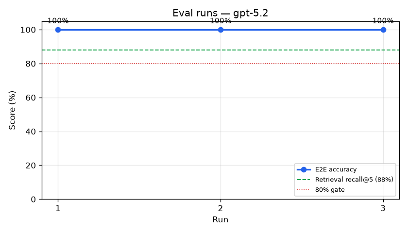
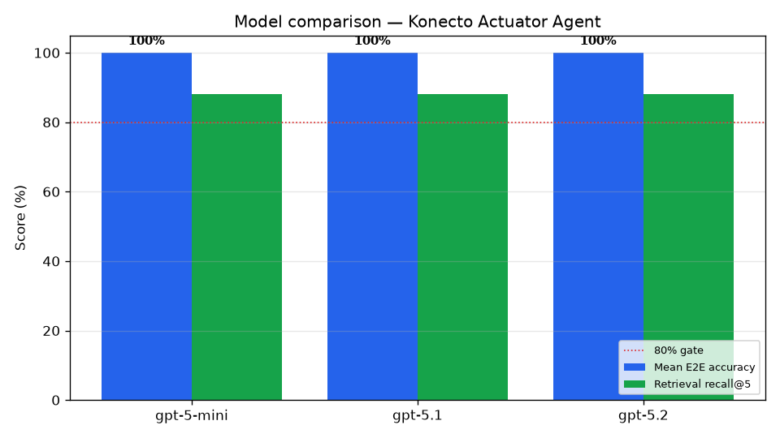

# Model comparison

Each chat model ran the **same** end-to-end eval suite against the **real** LLM (3 runs per model). Retrieval recall@5 is `88%` for all models (it depends on the embedding model, which is unchanged).

| Model | Runs | Mean accuracy | Min | Max |
|-------|------|---------------|-----|-----|
| `gpt-5-mini` | 3 | **100%** | 100% | 100% |
| `gpt-5.1` | 3 | **100%** | 100% | 100% |
| `gpt-5.2` | 3 | **100%** | 100% | 100% |

**Winner: `gpt-5-mini`** (highest mean accuracy). `gpt-5-mini` is kept as the dev/test default (budget-friendly, per the assessment), and the comparison justifies the production choice with data rather than intuition.

## Per-model progression

### `gpt-5-mini`

### `gpt-5.1`

### `gpt-5.2`

## Side by side

